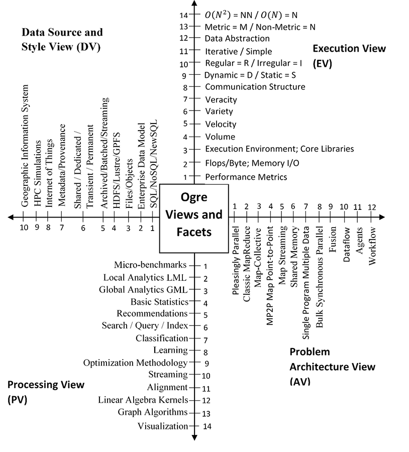

{style="max-width: 100%"}

[Home](index.html)    
                      
[Softwa               
re Tools](tools.html) 
                      
[Research Pro         
jects](projects.html) 
                      
Project Story         
                      
-   [SPI              
DAL](spidalproj.html) 
-   [M                
IDAS](midasproj.html) 
                      
[Papers](papers.html) 
                      
[M                    
embers](members.html) 
                      
[Meeting              
A                     
rchive](meeting.html) 

# Introduction

The goal for the SPIDAL project is to create software abstractions to
help connect communities together with applications in different
scientific fields, letting us collaborate and use other communities'
tools without having to understand all of their details. The project
will integrate features of traditional high-performance computing,
such as scientific libraries, communication and resource management
middleware, with the rich set of capabilities found in the commercial
Big Data ecosystem. The latter includes many important software
systems, such as Hadoop, available from the Apache open source
community.
                      
At present one of our main goals is to establish a set of benchmarks
for Big Data analysis in the spirit of the Berkeley Dwarfs and NIST
2013 Big Data Applications. Through the publication of several
research papers in the past year, we have sought to collect
applications and their feature and summarize key properties, followed
by identifying and classifying requirements with comparison to already
established attributes like those of NIST. Our work has culminated in
the definition of around 50 essential features or \'facets\' of Big
Data that we call Ogres.
                      
These Ogres are further divided into four distinct views: Problem
Architecture View (AV), Execution View (EV); Data Source and Style
View (DV), and Processing View (PV). The following table highlights
the different views and their corresponding facets.
                      
  

### NEWS
                      
For more information on SPIDAL\'s efforts to promote Research
Experiences for Undergraduates, visit the Digital Science Center
[website] (http://www.dsc.soic.  indiana.edu/reu2015).
                      
Dr. Geoffrey Fox delivered a presentation entitled \'Middleware and
High Performance Analytics Libraries for Scalable Data Science\' at a
workshop in the Pittsburgh Supercomputing Center on May 17, 2016.
Additional information can be found in the [Papers](papers.html)
section under Indiana University.
                      
The first workshop in the series STREAM2015 was held in Indianapolis
on October 27th and 28th, 2015. Its focus was on application features
and requirements as well as hardware and software systems needed to
support them. More details are available [here](http://str
eamingsystems.org/).\ Members of the community are invited to submit a
1-2 page White Paper/Statement of Interest in areas of relevance to
the workshop\'s scope and objectives. White papers are due by
September 21 and should be sent to workshop organizers.  Participants
will be selected based upon relevance of submissions as well as
strategic balance of expertise. Partial travel support is available
                      
Indiana University is pleased to host a new [Intel Parallel Computing
Center](htt p://ipcc.soic.iu.edu) as part of their longstanding
tradition blending industry and academia. Prof. Judy Qiu heads this
new center which also includes Prof. Steven Gottlieb of the IU Physics
Dept. In addition a \$320,000 award from Intel will be used in funding
research contributing to the SPIDAL project.
                      
A hands-on workshop on the topic of CINET, a web-based network
analysis tool, was hosted by the Virginia Bioinformatics Institute at
Virginia Tech on July 10 and August 11, 2015. More information [here]
(CINETWorkshop.pdf).\ In addition, Prof.  Judy Qiu hosted a seminar on
data analytics enhancement while attending the CINET workshop on July
9. Information on this seminar is found below:\ Agenda: \'Towards
HPC-ABDS: An Initial Experience Optimizing Hadoop for Scalable High
Performance Data Analytics\'\ Meeting number: 649 086 224\ Audio
connection:\ +1-855-749-4750 US TOLL FREE\ +1-415-655-0001 US TOLL\
Access code: 649 086 224\ Meeting link [here](https
://virginiatech.webex .com/virginiatech/j.p hp?MTID=ma40d4fafb6c1
032d304eff908b10a3f5)
                      
Kansas is preparing a 3-D imaging test setup for Dr.  Crandall at
Indiana University. This test setup is being designed to help ease
integration of Dr.  Crandall\'s global optimizer work into our 3-D
imaging routines. We are also doing background reading on hidden
Markov models and network flow algorithms for global optimization so
that we can better support the integration.
                      
In March 2015, co-PI Prof. Judy Qiu received an Outstanding Junior
Faculty award from Indiana University, as related in this IU [newsle
tter](http://news.ind iana.edu/releases/iu/ 2015/03/outstanding-j
unior-faculty.shtml).
                      
An October 2014 [article](http://n ews.indiana.edu/relea
ses/iu/2014/10/big-da ta-dibbs-grant.shtml) from Indiana University
addresses the SPIDAL project and IU faculty who will be working on it.
                      
Details are given on the DIBBs program, which includes our SPIDAL
project, in an NSF [anno uncement](http://www.  nsf.gov/news/news_sum
m.jsp?cntn_id=132880) from Oct. 2014.
                      
The official NSF award announcement for this project can be found [
here](http://www.nsf.  gov/awardsearch/showA ward?AWD_ID=1443054).
                      
Included here is a [link](http://new s.iu.edu/releases/iu/
2014/10/data-science- masters-degree.shtml) to Indiana University\'s
unveiling of a new Data Science Master\'s degree program in Oct. 2014.
                      
One of the first mentions hinting at the motivations which led to
SPIDAL came in an [article](http:/ /www.hpcwire.com/2014
/03/31/hpc-big-data-b est-worlds-approach/) in HPCWire newsletter in
March 2014.

