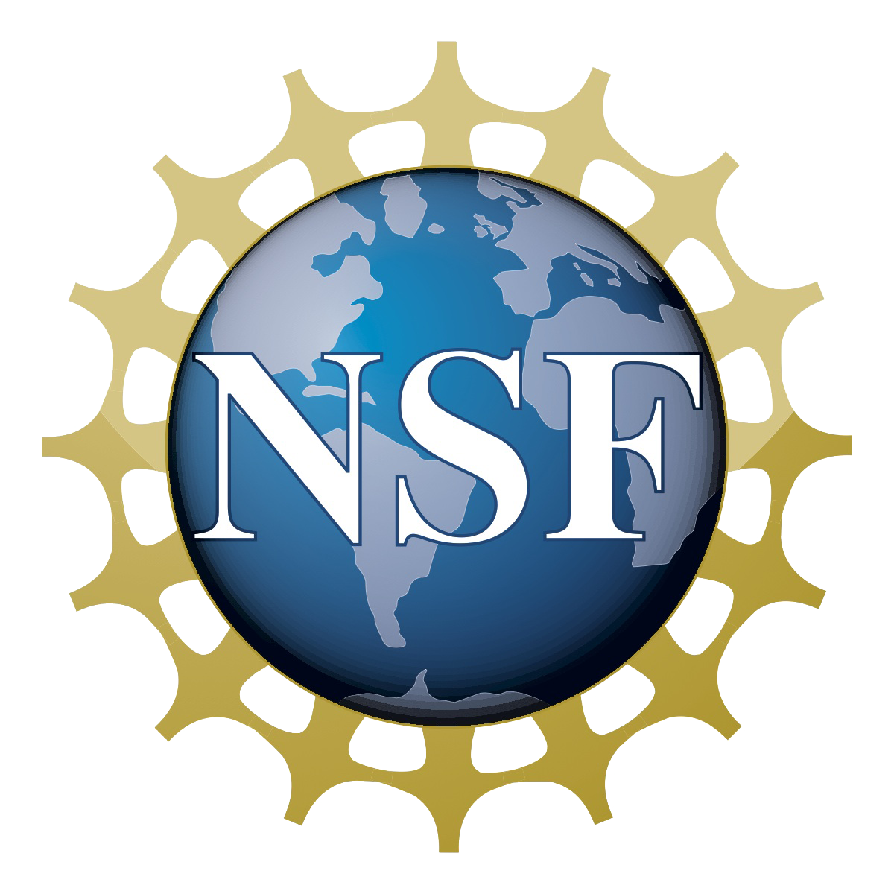

::: {align="center"}

{style="max-width: 100%"}

+----------------------:+-----------------------+-----------------------+
| ::: {#link}           | ::: {#main}           | ### NEWS {            |
| [Home](index.html)    | The goal for the      | #news align="center"} |
|                       | SPIDAL project is to  |                       |
| [Softwa               | create software       | :                     |
| re Tools](tools.html) | abstractions to help  | :: {style="margin-lef |
|                       | connect communities   | t: 1em; border-style: |
| [Research Pro         | together with         |  ridge; padding: 15px |
| jects](projects.html) | applications in       | ; padding-top: 0px;"} |
|                       | different scientific  | For more information  |
| Project Story         | fields, letting us    | on SPIDAL\'s efforts  |
|                       | collaborate and use   | to promote Research   |
| -   [SPI              | other communities'    | Experiences for       |
| DAL](spidalproj.html) | tools without having  | Undergraduates, visit |
| -   [M                | to understand all of  | the Digital Science   |
| IDAS](midasproj.html) | their details. The    | Center                |
|                       | project will          | [website]             |
| [Papers](papers.html) | integrate features of | (http://www.dsc.soic. |
|                       | traditional           | indiana.edu/reu2015). |
| [M                    | high-performance      |                       |
| embers](members.html) | computing, such as    | Dr. Geoffrey Fox      |
|                       | scientific libraries, | delivered a           |
| [Meeting              | communication and     | presentation entitled |
| A                     | resource management   | \'Middleware and High |
| rchive](meeting.html) | middleware, with the  | Performance Analytics |
| :::                   | rich set of           | Libraries for         |
|                       | capabilities found in | Scalable Data         |
|                       | the commercial Big    | Science\' at a        |
|                       | Data ecosystem. The   | workshop in the       |
|                       | latter includes many  | Pittsburgh            |
|                       | important software    | Supercomputing Center |
|                       | systems, such as      | on May 17, 2016.      |
|                       | Hadoop, available     | Additional            |
|                       | from the Apache open  | information can be    |
|                       | source community.     | found in the          |
|                       |                       | [Papers](papers.html) |
|                       | At present one of our | section under Indiana |
|                       | main goals is to      | University.           |
|                       | establish a set of    |                       |
|                       | benchmarks for Big    | The first workshop in |
|                       | Data analysis in the  | the series STREAM2015 |
|                       | spirit of the         | was held in           |
|                       | Berkeley Dwarfs and   | Indianapolis on       |
|                       | NIST 2013 Big Data    | October 27th and      |
|                       | Applications. Through | 28th, 2015. Its focus |
|                       | the publication of    | was on application    |
|                       | several research      | features and          |
|                       | papers in the past    | requirements as well  |
|                       | year, we have sought  | as hardware and       |
|                       | to collect            | software systems      |
|                       | applications and      | needed to support     |
|                       | their feature and     | them. More details    |
|                       | summarize key         | are available         |
|                       | properties, followed  | [here](http://str     |
|                       | by identifying and    | eamingsystems.org/).\ |
|                       | classifying           | Members of the        |
|                       | requirements with     | community are invited |
|                       | comparison to already | to submit a 1-2 page  |
|                       | established           | White Paper/Statement |
|                       | attributes like those | of Interest in areas  |
|                       | of NIST. Our work has | of relevance to the   |
|                       | culminated in the     | workshop\'s scope and |
|                       | definition of around  | objectives. White     |
|                       | 50 essential features | papers are due by     |
|                       | or \'facets\' of Big  | September 21 and      |
|                       | Data that we call     | should be sent to     |
|                       | Ogres.                | workshop organizers.  |
|                       |                       | Participants will be  |
|                       | These Ogres are       | selected based upon   |
|                       | further divided into  | relevance of          |
|                       | four distinct views:  | submissions as well   |
|                       | Problem Architecture  | as strategic balance  |
|                       | View (AV), Execution  | of expertise. Partial |
|                       | View (EV); Data       | travel support is     |
|                       | Source and Style View | available             |
|                       | (DV), and Processing  |                       |
|                       | View (PV). The        | Indiana University is |
|                       | following table       | pleased to host a new |
|                       | highlights the        | [Intel Parallel       |
|                       | different views and   | Computing             |
|                       | their corresponding   | Center](htt           |
|                       | facets.               | p://ipcc.soic.iu.edu) |
|                       |                       | as part of their      |
|                       | ::: {align="center"}  | longstanding          |
|                       |   | industry and          |
|                       | :::                   | academia. Prof. Judy  |
|                       | :::                   | Qiu heads this new    |
|                       |                       | center which also     |
|                       |                       | includes Prof. Steven |
|                       |                       | Gottlieb of the IU    |
|                       |                       | Physics Dept. In      |
|                       |                       | addition a \$320,000  |
|                       |                       | award from Intel will |
|                       |                       | be used in funding    |
|                       |                       | research contributing |
|                       |                       | to the SPIDAL         |
|                       |                       | project.              |
|                       |                       |                       |
|                       |                       | A hands-on workshop   |
|                       |                       | on the topic of       |
|                       |                       | CINET, a web-based    |
|                       |                       | network analysis      |
|                       |                       | tool, was hosted by   |
|                       |                       | the Virginia          |
|                       |                       | Bioinformatics        |
|                       |                       | Institute at Virginia |
|                       |                       | Tech on July 10 and   |
|                       |                       | August 11, 2015. More |
|                       |                       | information           |
|                       |                       | [here]                |
|                       |                       | (CINETWorkshop.pdf).\ |
|                       |                       | In addition, Prof.    |
|                       |                       | Judy Qiu hosted a     |
|                       |                       | seminar on data       |
|                       |                       | analytics enhancement |
|                       |                       | while attending the   |
|                       |                       | CINET workshop on     |
|                       |                       | July 9. Information   |
|                       |                       | on this seminar is    |
|                       |                       | found below:\         |
|                       |                       | Agenda: \'Towards     |
|                       |                       | HPC-ABDS: An Initial  |
|                       |                       | Experience Optimizing |
|                       |                       | Hadoop for Scalable   |
|                       |                       | High Performance Data |
|                       |                       | Analytics\'\          |
|                       |                       | Meeting number: 649   |
|                       |                       | 086 224\              |
|                       |                       | Audio connection:\    |
|                       |                       | +1-855-749-4750 US    |
|                       |                       | TOLL FREE\            |
|                       |                       | +1-415-655-0001 US    |
|                       |                       | TOLL\                 |
|                       |                       | Access code: 649 086  |
|                       |                       | 224\                  |
|                       |                       | Meeting link          |
|                       |                       | [here](https          |
|                       |                       | ://virginiatech.webex |
|                       |                       | .com/virginiatech/j.p |
|                       |                       | hp?MTID=ma40d4fafb6c1 |
|                       |                       | 032d304eff908b10a3f5) |
|                       |                       |                       |
|                       |                       | Kansas is preparing a |
|                       |                       | 3-D imaging test      |
|                       |                       | setup for Dr.         |
|                       |                       | Crandall at Indiana   |
|                       |                       | University. This test |
|                       |                       | setup is being        |
|                       |                       | designed to help ease |
|                       |                       | integration of Dr.    |
|                       |                       | Crandall\'s global    |
|                       |                       | optimizer work into   |
|                       |                       | our 3-D imaging       |
|                       |                       | routines. We are also |
|                       |                       | doing background      |
|                       |                       | reading on hidden     |
|                       |                       | Markov models and     |
|                       |                       | network flow          |
|                       |                       | algorithms for global |
|                       |                       | optimization so that  |
|                       |                       | we can better support |
|                       |                       | the integration.      |
|                       |                       |                       |
|                       |                       | In March 2015, co-PI  |
|                       |                       | Prof. Judy Qiu        |
|                       |                       | received an           |
|                       |                       | Outstanding Junior    |
|                       |                       | Faculty award from    |
|                       |                       | Indiana University,   |
|                       |                       | as related in this IU |
|                       |                       | [newsle               |
|                       |                       | tter](http://news.ind |
|                       |                       | iana.edu/releases/iu/ |
|                       |                       | 2015/03/outstanding-j |
|                       |                       | unior-faculty.shtml). |
|                       |                       |                       |
|                       |                       | An October 2014       |
|                       |                       | [article](http://n    |
|                       |                       | ews.indiana.edu/relea |
|                       |                       | ses/iu/2014/10/big-da |
|                       |                       | ta-dibbs-grant.shtml) |
|                       |                       | from Indiana          |
|                       |                       | University addresses  |
|                       |                       | the SPIDAL project    |
|                       |                       | and IU faculty who    |
|                       |                       | will be working on    |
|                       |                       | it.                   |
|                       |                       |                       |
|                       |                       | Details are given on  |
|                       |                       | the DIBBs program,    |
|                       |                       | which includes our    |
|                       |                       | SPIDAL project, in an |
|                       |                       | NSF                   |
|                       |                       | [anno                 |
|                       |                       | uncement](http://www. |
|                       |                       | nsf.gov/news/news_sum |
|                       |                       | m.jsp?cntn_id=132880) |
|                       |                       | from Oct. 2014.       |
|                       |                       |                       |
|                       |                       | The official NSF      |
|                       |                       | award announcement    |
|                       |                       | for this project can  |
|                       |                       | be found              |
|                       |                       | [                     |
|                       |                       | here](http://www.nsf. |
|                       |                       | gov/awardsearch/showA |
|                       |                       | ward?AWD_ID=1443054). |
|                       |                       |                       |
|                       |                       | Included here is a    |
|                       |                       | [link](http://new     |
|                       |                       | s.iu.edu/releases/iu/ |
|                       |                       | 2014/10/data-science- |
|                       |                       | masters-degree.shtml) |
|                       |                       | to Indiana            |
|                       |                       | University\'s         |
|                       |                       | unveiling of a new    |
|                       |                       | Data Science          |
|                       |                       | Master\'s degree      |
|                       |                       | program in Oct. 2014. |
|                       |                       |                       |
|                       |                       | One of the first      |
|                       |                       | mentions hinting at   |
|                       |                       | the motivations which |
|                       |                       | led to SPIDAL came in |
|                       |                       | an                    |
|                       |                       | [article](http:/      |
|                       |                       | /www.hpcwire.com/2014 |
|                       |                       | /03/31/hpc-big-data-b |
|                       |                       | est-worlds-approach/) |
|                       |                       | in HPCWire newsletter |
|                       |                       | in March 2014.        |
|                       |                       | :::                   |
+-----------------------+-----------------------+-----------------------+
:::

::: {align="center"}
{style="max-width: 100px; position: relative;"}
{style="max-width: 110px; position: relative;"}
:::
